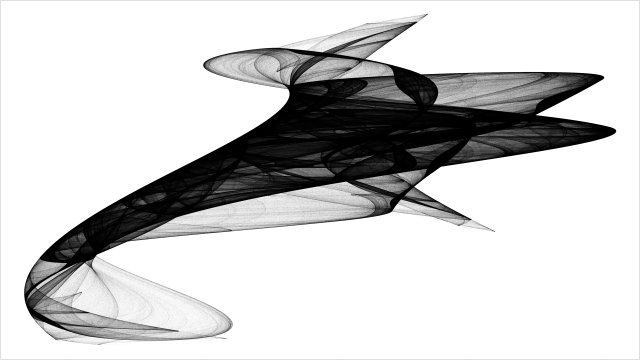
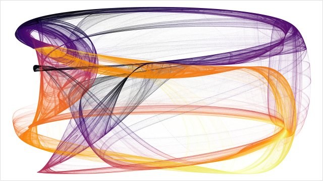
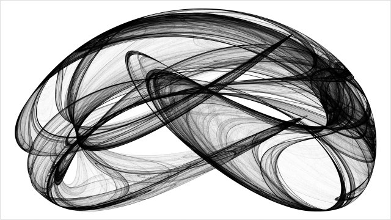
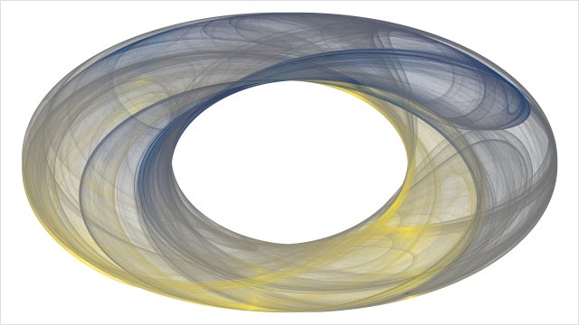

# Clifford Attractors

R code to generate beautiful high resolution [Clifford](https://en.wikipedia.org/wiki/Clifford_A._Pickover) attractors. The points of a
Clifford attractor are defined by

xₙ₊₁ = sin(*a* yₙ) + *c* cos(*a* xₙ)

yₙ₊₁ = sin(*b* xₙ) + *d* cos(*b* yₙ)

where *a*, *b*, *c*, *d* are constants. 

## Samples

In these plots, the colour is based on the angle between the current and
previous point. The *a*, *b*, *c*, *d* parameters are randomly drawn from a U(-3, 3) distribution.

